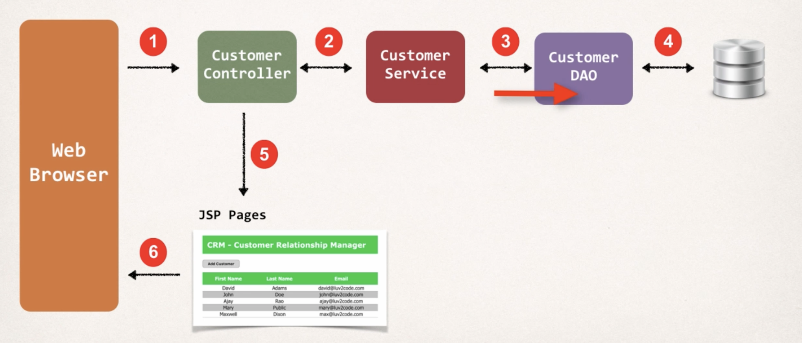
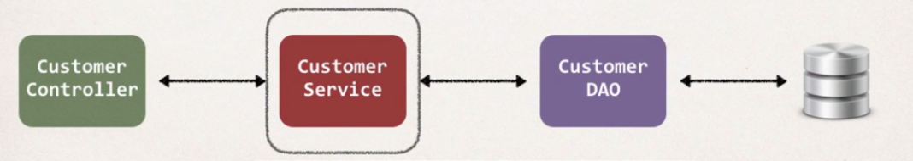
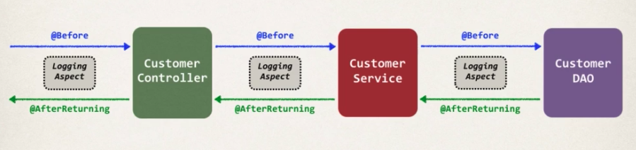

# CRM with Spring MVC and Hibernate

**Note: Compared to other outdated projects you find on github and from the course itself, this project has been updated with the last dependencies and can work with Java 17, plus, I used maven for the dependencies.**

An easy Customer Relationship Management App with few functionalities, based on the [udemy course offered by Chad](https://www.udemy.com/course/spring-hibernate-tutorial/learn/lecture/5836514#content) to show the functionalities of Spring MVC and Hibernate.

Few functionalities implemented:

- List Customers.
- Add a new Customer.
- Update a Customer.
- Delete a Customer.

## Architecture (Big Picture)

## Service Layer

We added the service layer to leverage the [**Service Layer design pattern**](https://en.wikipedia.org/wiki/Service_layer_pattern) (see even [service facade pattern](https://www.ibm.com/docs/pt-br/integration-bus/9.0.0?topic=SSMKHH_9.0.0/com.ibm.etools.mft.pattern.sen.doc/sen/sf/overview.htm)). On a much more complex project, we could use the service layer to  integrate multiple data sources (daos) and perform transaction  management between the two.

We moved @Transactional at service level, instead of a DAO level, because in future we can have different DAO methods that we would like to run in the same transaction.

Say for example we have:

BankDAO

\- deposit(...)

\- withdraw(...)

If we are transferring funds, we want that to run in the same transaction. By making use of @Transactional at service layer, then we can have this transactional support and both methods will run in the same  transaction. This would call deposit() and withdraw(). If either of  those methods failed then we'd want to roll the transaction back.

However, if we had @Transactional at DAO level instead of service level, then  the methods deposit() and withdraw() would run in separate transactions. If one of them failed, then we would not be able to rollback the other  method ... because it is in a separate transaction.

### Aspect Oriented Programming (AOP)

Aspect Oriented Programming (Wikipedia): In [computing](https://en.wikipedia.org/wiki/Computing), **aspect-oriented programming** (**AOP**) is a [programming paradigm](https://en.wikipedia.org/wiki/Programming_paradigm) that aims to increase [modularity](https://en.wikipedia.org/wiki/Modularity_(programming)) by allowing the [separation of](https://en.wikipedia.org/wiki/Separation_of_concerns) [cross-cutting concerns](https://en.wikipedia.org/wiki/Cross-cutting_concern). It does so by adding behavior to existing code (an [advice](https://en.wikipedia.org/wiki/Advice_(programming))) *without* modifying the code itself, instead separately specifying which code is modified via a "[pointcut](https://en.wikipedia.org/wiki/Pointcut)" specification, such as "log all function calls when the function's name begins with 'set'". This allows behaviors that are not central to the [business logic](https://en.wikipedia.org/wiki/Business_logic) (such as logging) to be added to a program without cluttering the code core to the functionality.

We added AOP Logging Aspect support to our CRM.

## How to run this application?

1. Install MySQL database

2. Run the database scripts to create a user and load sample data
   a. sql-scripts/01-create-user.sql
   b. sql-scripts/02-customer-tracker.sql

3. Open the source code for the appropriate version

4. Run the application: 
   a. Select the root project folder.
   b. Run based on your IDE (I am using IntelliJ).